# z80-sample-program

# Introduction

This is a small Z80 assembler program that just puts some colored lines on the ZX Spectrum's screen.

The intention is to use this as a kind of tutorial for [DeZog (Z80 debugger)](https://github.com/maziac/DeZog).

# Prerequisites

- Visual Studio Code (vscode)
- [DeZog](https://github.com/maziac/DeZog) (>= v3.3.0)

The program runs in the internal Z80 simulator but you can **optionally** run it on another emulator:
- the ZEsarUX emulator, https://github.com/chernandezba/zesarux  (known to work: v10.3, note: previous version will not work anymore with DeZog 3.3)
- the CSpect emulator, http://dailly.blogspot.com  (known to work: v2.19.3.0)
- MAME, https://www.mamedev.org (known to work: v0.242)

You can also run it on a "real" [ZX Spectrum Next](https://www.specnext.com) computer.

If you want to build the Z80 binary yourself (not required if you just want to test debugging):
- Z80 Assembler: sjasmplus, https://github.com/z00m128/sjasmplus (known to work: v1.20.2).

# GitHub Codespaces
This repository has Codespaces enabled.
I.e. to try out DeZog and the sample Z80/ZX Spectrum program you don't need to install vscode, sjasmplus or even DeZog:
If you have a github account you can simply open a codespace with everything pre-installed:
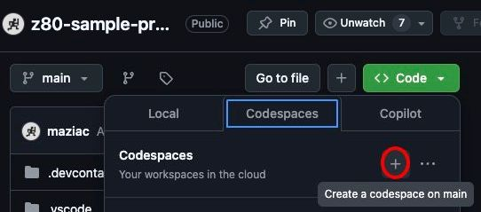

# Building

First if you just want to test debugging with the 'DeZog' extension there is no need to build/assemble the required files.
The binaries are included in this repository so that you could also directly start to debug.

However, if you would like to do some changes you need to compile.
From the menu choose "Terminal->Run Build Task..."
tasks.json is configured such that it will call sjasmplus with the required parameters. (Please note that you probably have to adjust the path to sjasmplus.)

There are several .asm files which are all included in the main.asm file. This file is the one being assembled.

After the build is ready a z80-sample-program.sna file is created which can be used with the internal simulator, ZEsarUX, CSpect or MAME.

# Running the Debugger with the Internal Z80 Simulator

The project comes with 6 configurations. One for the internal Z80 simulator, one for ZEsarUX, one for CSpect, one for MAME and one for the unit tests.

Choose the Z80 simulator first:
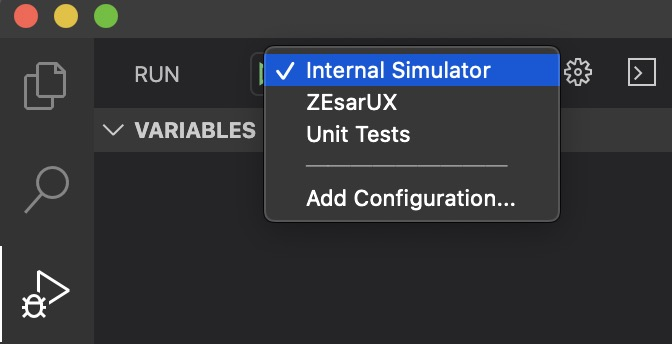

Now start the debug session by pressing the green arrow:
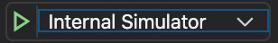

You should be left with a stopped program.
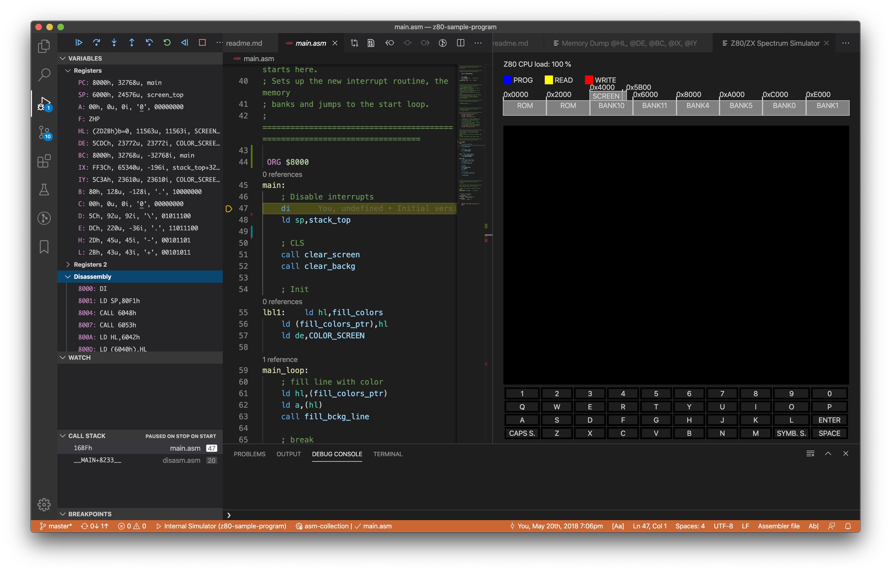

To the right you see the Z80 simulator. The black rectangle is the ZX Spectrum screen.

From here you can:
- step into, step over, step-out

- click on the call stack: It will navigate directly to the asm file.
- hover over register in the asm file: It will show the values and also (if available) the corresponding labels.
- change register values: a double click on the value of a register in the REGISTER area will allow you to enter a different value.

The internal Z80 simulator (zsim) allows basic Z80, ZX 48K/128K and ZX81 debugging.
For real emulation and other features (like ZXNext HW emulation) setup [ZEsarUX](#debug-with-zesarux), [CSpect](#debug-with-cspect) or [MAME](#debug-with-mame).

You can even [debug on a "real" ZX Next](#debug-with-a-zx-next-computer) if you like.

# The Program Itself

The program is only for educational purposes. It does nothing more than drawing colored lines on the screen.

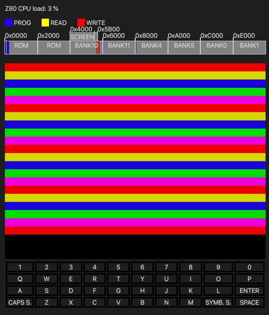

It does so by manipulating the color screen area (0x5800).

The action takes place in the 'main_loop':
1. it draws one colored line
2. it waits for a few moments
3. it proceeds to the next line
4. loop from 1

# Start emulators from vscode

The z80-sample-program includes a .vscode/tasks.json that contains tasks to start, ZEsarUX, CSpect or MAME.

But before using, please adopt the paths under "cwd" to the right path on your machine.
You can either directly change the paths in the tasks.json or you create a settings.json in the same folder and set the configuration parameters to your paths, e.g.:
settings.json:
~~~json
{
	"zesarux_dir": "/.../ZEsarUX10.1.app/Contents/MacOS",
	"cspect_dir": "/.../CSpect/CSpect2_16_6",
	"mame_dir": "/.../Projects/mame"
}
~~~
This should work for macos and Windows.

The emulator has to be started before entering a debug session with DeZog.
Normally you have to start an emulator only once to open/close several debugger session on it.
Just in case something is going wrong you need to restart the emulator.

An exception is the MAME emulator. It has to be restarted for every debug session. The tasks.json task already takes care of restarting.

# Debug with ZEsarUX

To debug the project first start ZEsarUx and enable the remote port (RCP) either by command line (--enable-remoteprotocol) or from the UI ('Settings->Debug->Remote protocol' to 'Enabled').
DeZog uses the port 10000 which is ZEsarUX default, so you can leave this unchanged.

When ZEsarUX is up and running start debugging from vscode.
Select ZEsarUX and press the green triangle:
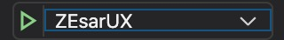

Now the following happens:

1. A socket ZRCP connection is opened to ZEsarUX
2. The snapshot (z80-sample-program.sna) is loaded to ZEsarUX
3. The breakpoints are reset
4. The .sld file is read
5. vscode requests the 'CALL STACK' and the 'VARIABLES' from ZEsarUX

You should be left with a stopped program like before with the Z80 simulator.

From here you can:
- step into, step over, step-out
- click on the call stack: It will navigate directly to the asm file.
- hover over register in the asm file: It will show the values and also (if available) the corresponding labels.
- change register values: a double click on the value of a register in the REGISTER area will allow you to enter a different value.

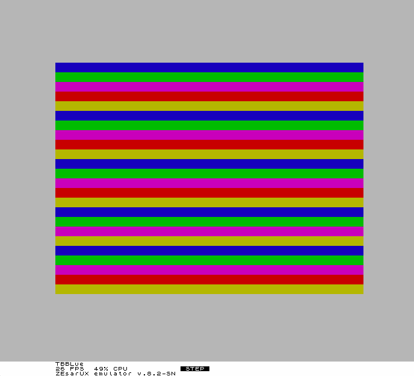

# Debug with CSpect

To debug the project first start [CSpect](http://dailly.blogspot.com).

Start CSpect from the console to verify that the DeZog/CSpect Plugin has started. You should see an output like "DeZog plugin started." followed by the port address the plugin is listening to.

When CSpect is up and running start debugging from vscode.
Select CSpect and press the green triangle:
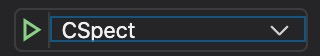

Now the following happens:

1. A socket DZRP connection is opened to CSpect
2. The snapshot (z80-sample-program.sna) is loaded to CSpect
3. The breakpoints are reset.
4. The .sld file is read
5. vscode requests the 'CALL STACK' and the 'VARIABLES' from CSpect

You should be left with a stopped program like before with the Z80 simulator.

From here you can:
- step into, step over, step-out
- click on the call stack: It will navigate directly to the asm file.
- hover over register in the asm file: It will show the values and also (if available) the corresponding labels.
- change register values: a double click on the value of a register in the REGISTER area will allow you to enter a different value.

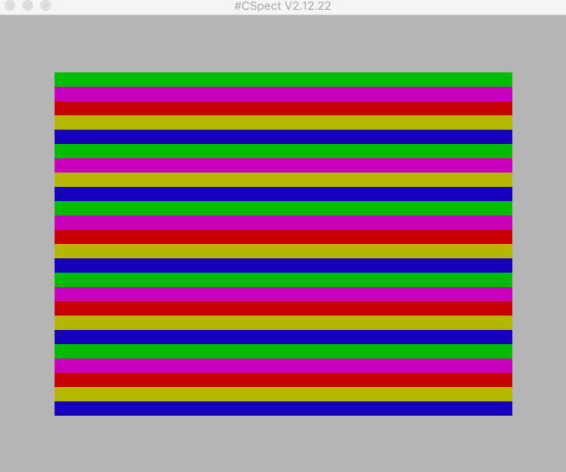

Note: DeZog uses a CSpect dll (DeZogPlugin.dll) for communication. In the past this was a separate program, nowadays it comes bundled with CSpect and is automatically started with CSpect.

# Debug with MAME

[MAME](https://www.mamedev.org) (as of version 0.242) does only support 1 connection. A 2nd connection attempt is refused.
This does not mean concurrent connection, it means: only 1 connection per session.
Therefore MAME needs to be terminated after each debug session.
DeZog sends MAME a kill command when the session is terminated.
The best debug experience at the moment is to re-start MAME in a loop, e.g. on linux/macOS use:
~~~bash
while true; do ./mame spectrum -window -debugger gdbstub -debug -debugger_port 12000 -verbose  -resolution 1024x768 ; sleep 2 ; done
~~~

MAME already loads the Spectrum ROM during startup. The z80-sample-program is transferred by DeZog to MAME as soon as the debug session is started with:

The sequence of actions is similar to CSpect:

1. A socket connection is opened to MAME (for transferring gdb commands)
2. The snapshot (z80-sample-program.sna) is loaded to MAME (Please note that for MAME only ZX48K sna files do work, no ZX128K files and o .nex files will work.)
3. The breakpoints are reset.
4. The .sld file is read
5. vscode requests the 'CALL STACK' and the 'VARIABLES' from MAME

You should be left with a stopped program like before with the Z80 simulator.

From here you can:
- step into, step over, step-out
- click on the call stack: It will navigate directly to the asm file.
- hover over register in the asm file: It will show the values and also (if available) the corresponding labels.
- change register values: a double click on the value of a register in the REGISTER area will allow you to enter a different value.

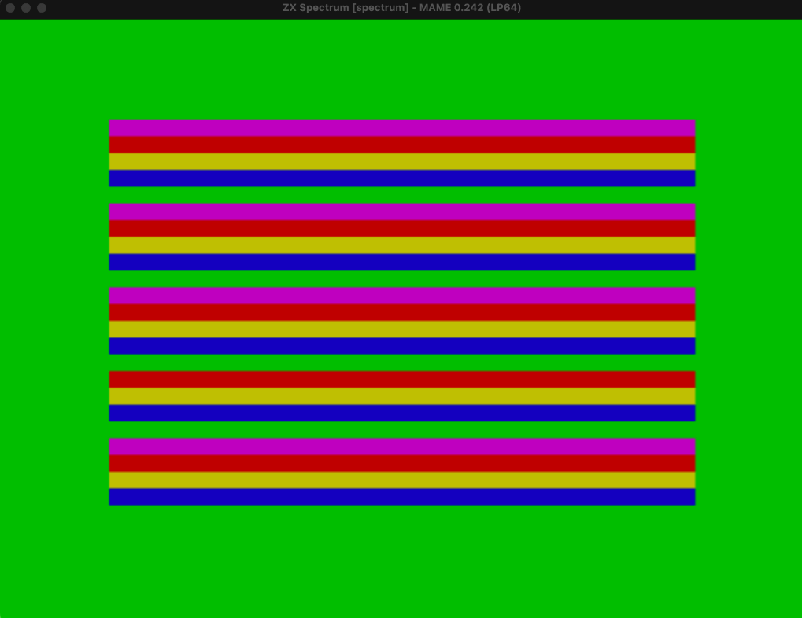

Note the wrong border color. This is because "load" (to load the sna file) does not support setting the border for MAME. I.e. to work correctly the program would have to set the border by itself.

MAME does not emulate the ZX Next, i.e. you cannot upload a .nex file. Use .sna in this case.

# Debug with a ZX Next Computer

To debug on a ZX Next you need serial cable to connect your PC/Mac with the ZX Next.
There is also some setup required on the ZX Next.
Please refer to the documentation in DeZog.

The launch.json must be modified to contain the serial interface of your PC/Mac:
~~~json
	"zxnext": {
		"serial": "<your COM port>"
	}
~~~

For a list of serial ports available on your PC/Mac you can use the command palette (F1):

Here is an example result (for a Mac):
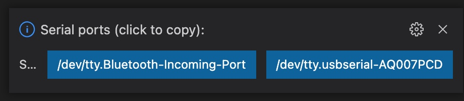

If everything is setup, start the ZXNext configuration (green triangle):
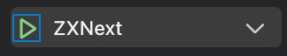

# Unit Tests

 The program also includes some unit tests to test the different memory fill subroutines.
 This configuration is hidden, i.e. you can't select it like the others in the vscode UI.
 But it is there in launch.json and it is used for executing and debugging the unit tests.
 DeZog includes the functionality to run the unit tests from the
 vscode graphical UI (the test explorer).

 Select the chemistry beaker icon on the left:

 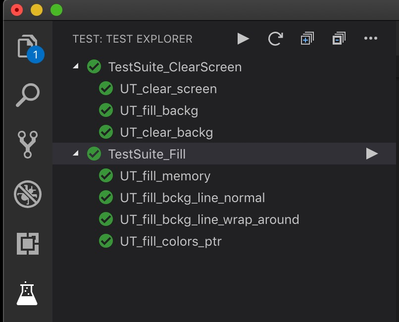

 Further details how to setup unit tests can be found [here](https://github.com/maziac/DeZog/blob/master/documentation/UnitTests.md).
