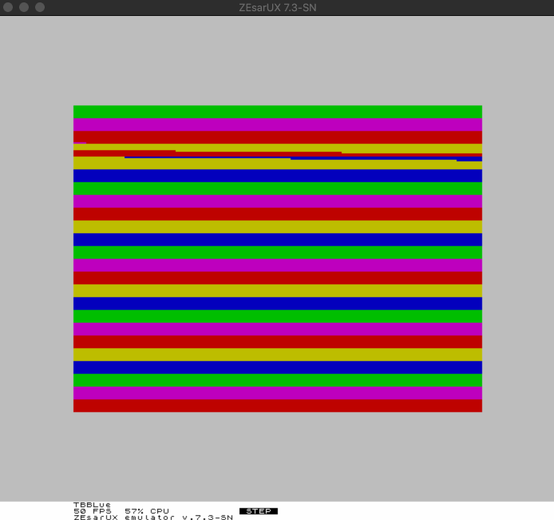

# z80-sample-program

# Introduction

This is a small Z80 assembler program that just puts some colored lines on the ZX Spectrum's screen.

The intention is to use this as a kind of tutorial for the [z80-debug extension](https://github.com/maziac/z80-debug) for vscode/ZEsarUX.

# Prerequisites

- Visual Studio Code (vscode)
- The [z80-debug adapter extension](https://github.com/maziac/z80-debug)
- The ZEsarUX emulator, https://github.com/chernandezba/zesarux  (>= v7.3)

If you want to build yourself (not required if you just want to test debugging): 
- Z80 Assembler: sjasmplus, https://github.com/z00m128/sjasmplus
- Following utilities are required: make

# Building

First if you just want to test debugging with the 'z80-debug' extension there is no need to build/assemble the required files.
The binaries are included in this repository so that you could also directly start to debug.

However, if you would like to do some changes you need to compile and here is the explanation:

The project includes a 'Makefile'.

To run it just use 'make' in the project's directory or from vscode menu choose 'Run build task...'. A .vscode/tasks.json is also included.

There are several .asm files which are all included in the main.asm file. This file is the one being assembled.

After the build is ready a z80-sample-program.sna file is created which can be used with ZEsarUX.

# Running the Debugger

To debug the project first start ZEsarUx and enable the remote port (RCP) either by commandline (--enable-remoteprotocol) or from the UI ('Settings->Debug->Remote protocol' to 'Enabled').
The debug adapter uses the port 10000 which is ZEsarUX default, so you can leave this unchanged.

When ZEsarUX is up and running start debugging from vscode. The "Z80 Debugger" is already configured so pressing the green debug arrow should be enough.

Now the following happens:

1. A socket RCP connection is opened to ZEsarUX.
2. The snapshot (z80-sample-program.sna) is loaded to ZEsarUX.
3. The breakpoints are reset.
4. The .list and .label files are read
5. vscode requests the 'CALL STACK' and the 'VARIABLES'
6. call stack, disassembly and the registers values are requested from ZEsarUX.

You should be left with a stopped program. 

From here you can:
- step into, step over, step-out
- click on the call stack: It will navigate directly to the asm file.
- hover over register in the asm file: It will show the values and also (if available) the corresponding labels.
- change register values: a double click on the value of a register in the REGISTER area will allow you to enter a different value.

# The Program Itself

The program is only for educational purposes. It does nothing more than drawing colored lines on the screen.

It does so by manipulating the color screen area (0x5800).

The action takes place in the 'main_loop':
1. it draws a one color line
2. it waits for half a second
3. it proceeds to the next line
4. loop from 1

# Unit Tests

The program also includes some unit tests to test the different memory fill subroutines.
Details how to setup unit tests can be found [here](https://github.com/maziac/z80-debug/blob/master/documentation/UnitTests.md).

To run the unit test from a graphical UI (the test explorer) you additionally require the [z80-unit-tests](https://github.com/maziac/z80-unit-tests) extension.

